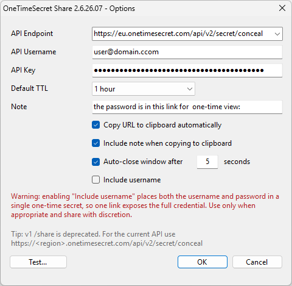
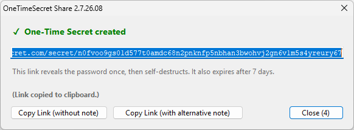

# OneTimeSecret Share - KeePass 2.x Plugin

Share a KeePass entry's password as a **one-time, self-destructing link** via
[Onetime Secret](https://onetimesecret.com/), straight from the entry's
right-click menu. No more pasting passwords into chats or emails - send a link
that reveals the secret once and then destroys it.


> Not affiliated with Onetime Secret or the KeePass project. "KeePass" and
> "Onetime Secret" are the property of their respective owners.

---

## Features

- **One-click sharing** - right-click any entry → **Share Password via OneTimeSecret…**
- **Keyboard shortcut** - `Ctrl+Z` on a selected entry creates the link
- **Onetime Secret API v2** (`/api/v2/secret/conceal`), with automatic
  fallback handling for the deprecated v1 `/api/v1/share` endpoint
- **Regional hosts** - pick EU, US, UK, CA or NZ from a drop-down, or type a
  custom / self-hosted URL
- **Branded share domain** (optional) - generate links on your own custom domain
  (e.g. `secrets.example.com`) instead of the onetimesecret.com host, when that
  domain is configured on your OTS account
- **Configurable TTL** - 5 minutes to 14 days
- **Two clipboard notes** - a **default** note (prepended automatically) and an
  **alternate** note for a different audience or language (e.g. one in English,
  one in Italian). Both are **multi-line**, and each is placed above the link.
- **Include username** (optional) - put both `Username:` and `Password:` in the
  secret, with a clear on-screen warning
- **Auto-close** - optionally close the result window after *N* seconds, with a
  live countdown on the Close button
- **Result dialog** with three copy options - **Copy Link (without note)**,
  **Copy Link (with alternative note)**, and **Close**. 
- **Credential protection** - the API key is stored **DPAPI-encrypted**
  (per Windows user) in `KeePass.config.xml`

---

## Screenshots

| Options | Result dialog |
| --- | --- |
|  |  |

---

## Requirements

- **KeePass 2.42 or later** (the plugin uses the modern `GetMenuItem` /
  `PluginMenuType` API)
- **.NET Framework 4.5+** (present on all supported Windows versions; KeePass
  uses it to compile the plugin)
- **Windows** (the API key is protected with Windows DPAPI)
- An **Onetime Secret account / API key** (hosted or self-hosted)

---

## Installation

1. Download **`OneTimeSecretShare.plgx`** from the
   [Releases](../../releases) page.
2. Copy it into the KeePass **Plugins** folder
   (e.g. `C:\Program Files\KeePass Password Safe 2\Plugins`).
3. Restart KeePass. Confirm it loaded under **Tools → Plugins**.


> **Updating:** When you replace the `.plgx` with a newer version, clear the
> plugin cache (**Tools → Plugins → Clear**, or delete
> `%LocalAppData%\KeePass\PluginCache`) and restart, so KeePass recompiles the
> new build instead of serving the cached one.

---

## Configuration

Open **Tools → OneTimeSecret Share Options…**

| Setting | Description |
| --- | --- |
| **API Endpoint** | Drop-down of the regional v2 hosts; editable for a custom / self-hosted URL. |
| **API Username** | Your Onetime Secret account username (email). |
| **API Key** | Your Onetime Secret API key. Stored **DPAPI-encrypted** in `KeePass.config.xml`. |
| **Share domain** | *(optional)* A custom/branded domain configured on your OTS account (e.g. `secrets.example.com`). The share link is then generated on that domain. |
| **Default TTL** | How long the secret lives before it expires (5 min … 14 days). |
| **Note - Default** | *(multi-line)* Free text prepended above the link on automatic copy (see below). |
| **Note - Alternate** | *(multi-line)* A second note for a different audience/language, used by the **Copy Link (with alternative note)** button. |
| **Copy URL to clipboard automatically** | Copy the link as soon as it's created. |
| **Include note when copying to clipboard** | Prepend the **default** note (own line) above the link on auto-copy. |
| **Auto-close window after _N_ seconds** | Automatically close the result dialog after the given number of seconds. |
| **Include username** | Put both the username and password in the secret. |
| **Test…** | Creates a throwaway secret to verify your endpoint and credentials. |

### Regional endpoints

```
https://eu.onetimesecret.com/api/v2/secret/conceal
https://us.onetimesecret.com/api/v2/secret/conceal
https://uk.onetimesecret.com/api/v2/secret/conceal
https://ca.onetimesecret.com/api/v2/secret/conceal
https://nz.onetimesecret.com/api/v2/secret/conceal
```

The share link is generated on the same regional host, e.g.
`https://eu.onetimesecret.com/secret/<key>` - unless you set a **Share domain**,
in which case the link is generated on that custom domain instead.

---

## Usage

1. Select an entry.
2. **Right-click → Share Password via OneTimeSecret…**, or press **`Ctrl+Z`**.
3. The result dialog shows the one-time link (already on your clipboard if
   auto-copy is on). Paste it wherever you need to.

With **Include note** enabled, the automatic copy uses your **default** note, so
a paste looks like:

```
The password is in this link for one-time view:
https://eu.onetimesecret.com/secret/lmb0qn6hq99ardptz7n7554kmcdui7owqiuak
```

- **Copy Link (without note)** - the bare URL only.
- **Copy Link (with alternative note)** - the **alternate** note followed by the
  URL (enabled only when an alternate note is set). Handy when working with
  different audience or language than your default note.
- **Close**.

Typical two-language workflow: set the default note in one language (used on
auto-copy) and the alternate note in another, then click **Copy Link (with
alternative note)** when the recipient needs the other language.

---

## Security notes

- **The API key at rest** is encrypted with Windows **DPAPI** (CurrentUser
  scope) before being written to `KeePass.config.xml`. It is invoked through
  late binding so the plugin needs no extra assembly reference.
- **The password in memory** is read directly from KeePass's `ProtectedString`
  into a UTF-8 `byte[]` (via `ReadUtf8`) - it is never materialised as a managed
  `string`. The request body is built at the byte level, sent, and then the
  password bytes and body buffer are **zeroed** (`Array.Clear`).
  - *Limitations:* copies made inside `HttpWebRequest` and the TLS stack are
    outside the plugin's control and cannot be zeroed, and the value is - by
    design - transmitted to your Onetime Secret server. This is sound
    defence-in-depth, not a guarantee of unrecoverability.
- **Include username** places both the username and password into a single
  one-time secret, so **one link exposes the full credential**. Enable it only
  when appropriate for the recipient and channel.

---

## How it works

- The plugin registers an entry menu item (context menu and the **Entry** menu)
  via KeePass's `GetMenuItem(PluginMenuType.Entry)` API.
- It detects **v2** when the endpoint contains `/v2/` or `/conceal`, otherwise it
  uses the legacy **v1** form. The v2 request body follows the current spec:

  ```json
  {"secret":{"kind":"conceal","secret":"...","ttl":"3600","share_domain":"secrets.example.com"}}
  ```

- The share link is built from `record.secret.key` and the domain the server
  returns (`record.share_domain`), falling back to your configured **Share
  domain** and then the API host.

---

## Troubleshooting

**The plugin doesn't appear in Tools → Plugins (no error).**
Make sure the `.plgx` is in the KeePass **Plugins** folder, that you restarted
KeePass, and - if you just replaced an older copy - that you **cleared the
plugin cache** (**Tools → Plugins → Clear**) and restarted so the new build is
compiled instead of the cached one.

**`HTTP 401 / 403`.**
Check the API username and key, and that the key is valid for the selected
regional host.

---

## Changelog

| Version | Highlights |
| --- | --- |
| **2.9.26.09** | **Multi-line notes** - "Note - Default" and "Note - Alternate" are now multi-line text boxes. |
| **2.8.26.08** | **Branded share domain** - generate links on your own custom domain. |
| **2.7.26.08** | Two clipboard notes (**default** + **alternate**); **Copy Link (with alternative note)** button in the result dialog. |
| **2.6.26.07** | Bold "(Link copied to clipboard.)"; **Auto-close after N seconds** with countdown. |
| **2.5.26.07** | **Copy Link (without note)** button; version shown in window titles. |
| **2.4.26.07** | API endpoint **regional drop-down**; **Include username** option + warning. |
| **2.3.26.07** | Fixed v2 payload (wrapped `conceal` body); **Note** field + include-note-on-copy; hardened in-memory password handling (byte-level, zeroed). |
| **1.0.26.07** | Initial release. |

---

## License

Released under the **MIT License** - see [LICENSE](LICENSE).

---

## Author

**David S.**

Built for sharing credentials safely from KeePass. Contributions and issues are
welcome.
